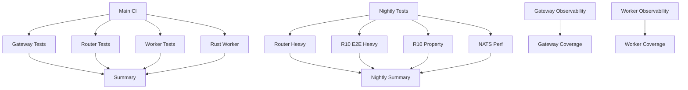

# GitHub Actions Workflow Structure

```
┌─────────────────────────────────────────────────────────────────┐
│                     GitHub Actions CI/CD                         │
└─────────────────────────────────────────────────────────────────┘

┌─────────────────────────────────────────────────────────────────┐
│  📋 Main CI Workflow (ci.yml)                                   │
│  Trigger: Push/PR to main/master                                │
├─────────────────────────────────────────────────────────────────┤
│                                                                  │
│  ┌──────────────┐  ┌──────────────┐  ┌──────────────┐          │
│  │   Gateway    │  │    Router    │  │    Worker    │          │
│  │    Tests     │  │    Tests     │  │    Tests     │          │
│  │  (reusable)  │  │  (reusable)  │  │  (reusable)  │          │
│  └──────────────┘  └──────────────┘  └──────────────┘          │
│         │                 │                 │                    │
│         └─────────────────┴─────────────────┘                    │
│                           │                                      │
│                    ┌──────▼──────┐                               │
│                    │  Summary    │                               │
│                    │   Report    │                               │
│                    └─────────────┘                               │
└─────────────────────────────────────────────────────────────────┘

┌─────────────────────────────────────────────────────────────────┐
│  🌙 Nightly Tests (nightly-tests.yml)                           │
│  Trigger: Schedule (2 AM UTC) / Manual                          │
├─────────────────────────────────────────────────────────────────┤
│                                                                  │
│  ┌────────────────┐  ┌────────────────┐  ┌────────────────┐   │
│  │ Router Heavy   │  │  R10 E2E Heavy │  │  R10 Property  │   │
│  │  Tier Tests    │  │  (50x100 reqs) │  │  Based Tests   │   │
│  └────────────────┘  └────────────────┘  └────────────────┘   │
│                                                                  │
│  ┌────────────────────────────────────────────────────────┐    │
│  │         Router NATS Performance Tests                   │    │
│  └────────────────────────────────────────────────────────┘    │
│                           │                                      │
│                    ┌──────▼──────┐                               │
│                    │  Summary    │                               │
│                    │   Report    │                               │
│                    └─────────────┘                               │
└─────────────────────────────────────────────────────────────────┘

┌─────────────────────────────────────────────────────────────────┐
│  🛠️ Gateway Tests (gateway-tests.yml)                           │
│  Trigger: Changes in apps/c-gateway/**                          │
├─────────────────────────────────────────────────────────────────┤
│                                                                  │
│  ┌──────────────────────────────────────────────────────┐       │
│  │  gateway-observability-tests                          │       │
│  │  • Build Gateway                                      │       │
│  │  • Unit Tests                                         │       │
│  │  • Integration Tests                                  │       │
│  │  • Performance Tests                                  │       │
│  │  • E2E Tests                                          │       │
│  └──────────────────────────────────────────────────────┘       │
│                           │                                      │
│                           ▼                                      │
│  ┌──────────────────────────────────────────────────────┐       │
│  │  gateway-coverage                                     │       │
│  │  • Build with Coverage                                │       │
│  │  • Generate lcov Report                               │       │
│  │  • Upload HTML Coverage                               │       │
│  └──────────────────────────────────────────────────────┘       │
└─────────────────────────────────────────────────────────────────┘

┌─────────────────────────────────────────────────────────────────┐
│  🔧 Router Tests (router-tests.yml)                             │
│  Trigger: Changes in apps/otp/router/**                         │
├─────────────────────────────────────────────────────────────────┤
│                                                                  │
│  Fast Tier (Always)          Full Tier (main/PR)                │
│  ┌──────────────────┐        ┌──────────────────┐              │
│  │ router-ct-fast   │        │ router-ct-full   │              │
│  │ • Unit Tests     │        │ • All Tests      │              │
│  │ • Critical Integ │        │ • Except Heavy   │              │
│  └──────────────────┘        └──────────────────┘              │
│                                                                  │
│  R10 Circuit Breaker Tests                                      │
│  ┌──────────────────┐  ┌──────────────────┐                    │
│  │ router-r10-unit  │  │ router-r10-e2e-ci│                    │
│  │ • CB Logic Tests │  │ • 10 × 20 reqs   │                    │
│  └──────────────────┘  └──────────────────┘                    │
│                                                                  │
│  ┌────────────────────────────────────────┐                     │
│  │ router-r10-protective-rails            │                     │
│  │ • Validation Scripts                   │                     │
│  └────────────────────────────────────────┘                     │
└─────────────────────────────────────────────────────────────────┘

┌─────────────────────────────────────────────────────────────────┐
│  ⚙️ Worker Tests (worker-tests.yml)                             │
│  Trigger: Changes in apps/caf/processor/**                      │
├─────────────────────────────────────────────────────────────────┤
│                                                                  │
│  ┌──────────────────────────────────────────────────────┐       │
│  │  worker-observability-tests                           │       │
│  │  • Build Worker (CMake)                               │       │
│  │  • ObservabilityTest                                  │       │
│  │  • HealthEndpointTest                                 │       │
│  │  • ObservabilityPerformanceTest                       │       │
│  └──────────────────────────────────────────────────────┘       │
│                           │                                      │
│                           ▼                                      │
│  ┌──────────────────────────────────────────────────────┐       │
│  │  worker-coverage                                      │       │
│  │  • Build with Coverage (CMake)                        │       │
│  │  • ctest --verbose                                    │       │
│  │  • Generate lcov Report                               │       │
│  └──────────────────────────────────────────────────────┘       │
└─────────────────────────────────────────────────────────────────┘

┌─────────────────────────────────────────────────────────────────┐
│  ✅ Validation Workflows                                        │
├─────────────────────────────────────────────────────────────────┤
│                                                                  │
│  validate-cp2.yml            ci-validate.yml                    │
│  • CP2 Contract Validation   • CI Schema Validation             │
│                                                                  │
│  devstate-hooks-tests.yml                                       │
│  • DevState Hooks Testing                                       │
└─────────────────────────────────────────────────────────────────┘

┌─────────────────────────────────────────────────────────────────┐
│  📦 Artifacts (retention: 7-14 days)                            │
├─────────────────────────────────────────────────────────────────┤
│  • Test results (JUnit XML)                                     │
│  • Coverage reports (HTML + lcov)                               │
│  • Test logs (router _build/test/logs)                          │
│  • Metrics dumps (R10, NATS performance)                        │
│  • Build artifacts                                              │
└─────────────────────────────────────────────────────────────────┘

┌─────────────────────────────────────────────────────────────────┐
│  🔄 Trigger Summary                                             │
├─────────────────────────────────────────────────────────────────┤
│  Push to main           → Main CI                               │
│  Pull Request           → Main CI                               │
│  Changes in Gateway     → Gateway Tests                         │
│  Changes in Router      → Router Tests                          │
│  Changes in Worker      → Worker Tests                          │
│  Schedule (2 AM UTC)    → Nightly Tests                         │
│  Manual Dispatch        → Any workflow                          │
└─────────────────────────────────────────────────────────────────┘
```

## Workflow Dependencies



## File Organization

```
.github/
├── workflows/
│   ├── ci.yml                      # Main CI orchestrator
│   ├── gateway-tests.yml           # Gateway component tests
│   ├── router-tests.yml            # Router component tests
│   ├── worker-tests.yml            # Worker component tests
│   ├── nightly-tests.yml           # Heavy/scheduled tests
│   ├── validate-cp2.yml            # CP2 validation
│   ├── ci-validate.yml             # CI validation
│   ├── devstate-hooks-tests.yml    # DevState hooks
│   └── README.md                   # Workflows documentation
├── QUICKSTART.md                   # Quick start guide
├── GITHUB_ACTIONS_MIGRATION.md     # Migration from GitLab
└── WORKFLOW_STRUCTURE.md           # This file
```

## Key Features

### ✅ Concurrency Control
Each workflow has concurrency groups to cancel in-progress runs:
```yaml
concurrency:
  group: ci-${{ github.ref }}
  cancel-in-progress: true
```

### ✅ Path Filters
Workflows run only when relevant files change:
```yaml
on:
  push:
    paths:
      - 'apps/c-gateway/**'
```

### ✅ Caching
Dependencies are cached for faster builds:
- Erlang rebar3 cache
- Node.js pnpm cache

### ✅ Matrix Builds
Router tests run on multiple Erlang versions (25.3, 26.0)

### ✅ Reusable Workflows
Component tests are reusable workflows called from main CI

## Migration from GitLab CI

All GitLab CI jobs have equivalent GitHub Actions workflows:
- Same test coverage
- Same quality gates
- Same artifact retention
- Parallel execution where possible

See [GITHUB_ACTIONS_MIGRATION.md](GITHUB_ACTIONS_MIGRATION.md) for details.
