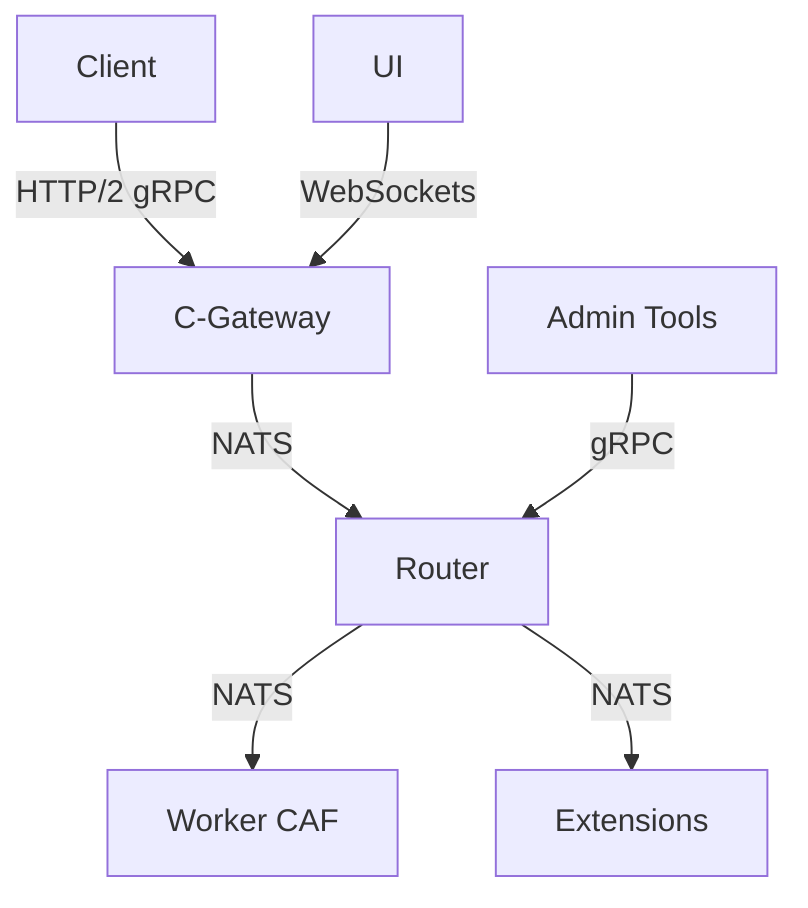

# Beamline Constructor

[](https://opensource.org/licenses/Apache-2.0)
[](https://ci.beamline.example.com/beamline/beamline)
[](https://docs.beamline.ai)

## 🚀 Overview

Beamline Constructor is an **operating system for AI factories** (AI Production Line) - a unified orchestrator platform where AI agents, API services, and humans work as one cohesive system.

### ✨ Key Features

- **Unified Orchestration**: Seamlessly coordinate AI agents, APIs, and human workflows
- **Production-Grade AI**: Deploy and manage AI models with enterprise-grade SLAs
- **Secure by Design**: Built-in security and compliance at every layer
- **Observability First**: Comprehensive monitoring, tracing, and logging
- **Extensible Architecture**: Plugin system for custom integrations

## 🏗️ Architecture

Beamline Constructor is built on a modern, distributed architecture:



### Core Components

| Component | Description | Status |
|-----------|-------------|--------|
| [C-Gateway](apps/c-gateway) | High-performance API Gateway | ✅ Production Ready |
| [Router](apps/otp/router) | Intelligent request routing & orchestration | ✅ Production Ready |
| [Worker CAF](apps/caf/processor) | High-performance compute engine | ✅ Production Ready |
| [UI](apps/ui_web) | Web-based management interface | 🚧 In Development |
| [Extensions](docs/EXTENSIONS_QUICKSTART.md) | Pluggable services | 📦 Beta |

## 🚀 Getting Started

### Prerequisites

- Docker & Docker Compose
- Erlang/OTP 26+
- C++20 compatible compiler
- Node.js 18+ (for UI development)

### Quick Start

```bash
# Clone the repository
git clone https://github.com/rustkas/beamline-sheduler.git
cd beamline-sheduler

# Start the development environment
docker-compose up -d

# Access the web UI (after containers are up)
open http://localhost:4000
```

## 📚 Documentation

For comprehensive documentation, please visit our [documentation portal](https://docs.beamline.ai) or explore the following key resources:

- [Architecture Overview](docs/ARCHITECTURE.md)
- [API Reference](docs/API_CONTRACTS.md)
- [Deployment Guide](docs/DEPLOYMENT.md)
- [Developer Guide](docs/DEVELOPER_GUIDE.md)
- [Operational Guide](docs/OPERATIONS_GUIDE_RU.md)

## 🤝 Contributing

We welcome contributions! Please see our [Contributing Guide](CONTRIBUTING.md) for details on how to:

- Report issues
- Submit pull requests
- Set up your development environment
- Follow our coding standards

## 📄 License

This project is licensed under the Apache 2.0 License - see the [LICENSE](LICENSE) file for details.

## 📞 Support

For support, please:
1. Check the [troubleshooting guide](docs/TROUBLESHOOTING.md)
2. Search [existing issues](https://github.com/beamline/beamline/issues)
3. Open a new issue if your problem isn't addressed
   - See: `docs/EXTENSIONS_API.md`

**For detailed component information**: See `docs/CORE_COMPONENTS.md` and `docs/SYSTEM_METADATA.md`

All other subprojects (Provider, Usage, DevState, Scripts, Tools, etc.) are **supporting tools** for development process.

See [Core Components](docs/CORE_COMPONENTS.md) for detailed breakdown.

### Important Note:
**Development state management** (`.trae` files, DevState) is external development tooling and **not part of Beamline Constructor product logic**.

See [official project vision](docs/BEAMLINE_OFFICIAL_VISION.md) and [tooling role](docs/TOOLING_TRAE_DEVSTATE_ROLE.md).

## Principles

- **No-Drift**: all artifacts are synchronized by versions, checksums are validated before checkpoint transitions
- **Source of Truth**: ABI (protobuf), DDL (SQL), NATS subjects registry - single sources of truth
- **Audit**: all operations are logged through Erlang-managed audit system (separate from TRAE development tooling)
- **Checkpoints (CP)**: phased development with validation at each stage

## Contributing

See [CONTRIBUTING.md](CONTRIBUTING.md) for development guidelines and contribution process.

**Important**: Any changes to JetStream, NATS, or Observability (OBS) components **MUST** update the formal coverage documentation:
- Coverage Matrix: `apps/otp/router/docs/dev/JETSTREAM_OBS_COVERAGE_MATRIX.md`
- Fault Injection Test Scenarios: `apps/otp/router/docs/dev/JETSTREAM_FAULT_INJECTION_TESTS.md`
- Alert Rules Scenario IDs: `apps/otp/router/docs/observability/router-alert-rules.yaml`
- Dashboard Panel Scenario IDs: `docs/OBSERVABILITY_ROUTER_DASHBOARD.md`

See `CONTRIBUTING.md#jetstreamnatsob-changes` for detailed instructions.

## Operational Readiness (CP1)

### Status

- **Compilation**: ✅ Successful
- **Tests**: ✅ New integration tests added and compile
- **Dialyzer**: ✅ Warnings addressed (dependencies updated, targeted nowarn)
- **Configuration**: ✅ Finalized (NATS TLS, timeouts, reconnects)
- **Documentation**: ✅ Updated across `CONFIG.md`, `API_CONTRACTS.md`, `ROUTER_CAF_GATING_CHECK_REPORT.md`, `apps/otp/router/docs/OPERATIONAL_GUIDE.md`

### Key Artifacts

- **`apps/otp/router/docs/OPERATIONAL_GUIDE.md`**: Pre-production checklist, configuration guidance, smoke tests, gradual rollout strategy, emergency procedures, monitoring recommendations
- **New Integration Tests**: 
  - `test_payload_size_limit/1`: Validates NATS payload size limit
  - `test_version_validation_missing/1`: Validates missing version rejection
  - `test_version_validation_unsupported/1`: Validates unsupported version rejection
- **Updated Documentation**:
  - `apps/otp/router/docs/ROUTER_CAF_GATING_CHECK_REPORT.md`: Dialyzer warnings details and resolution
  - `apps/otp/router/docs/CONFIG.md`: NATS configuration (TLS, limits, timeouts)
  - `apps/otp/router/docs/API_CONTRACTS.md`: Schema version validation rules

### Staging Rollout Checklist

Before deploying to staging, ensure:

1. **Pre-Production Checklist**: Follow checklist in `apps/otp/router/docs/OPERATIONAL_GUIDE.md`
2. **NATS Payload Size Limit**: Validate payload size limit before JSON parsing
3. **Schema Version Validation**: Confirm validation for missing/unsupported versions
4. **Retry Parameters**: Set `caf_max_retries` and `caf_retry_base_ms` per SLA/latency guidance
5. **Smoke Tests**: Run 5 smoke tests from `OPERATIONAL_GUIDE.md` and monitor telemetry counters/spans
6. **Kill-Switch and Allowlist**: Keep `caf_push_assignment_enabled` and `caf_push_assignment_allowed_tenants` aligned with access policies

See `apps/otp/router/docs/OPERATIONAL_GUIDE.md` for detailed staging rollout plan.

### Training Videos Quickstart

**Recommended Topics** (for future video series):

1. **Architecture Overview**: Router ↔ CAF modules, configuration, message flow
2. **Quickstart with NATS TLS**: Setup, connection, verification
3. **DecideRequest Validation**: Schema version rules and tests
4. **ExecAssignment Publishing**: `push_assignment` flag and subject configuration
5. **Deadlines**: `deadline_ms` calculation and overrides
6. **Retry Logic**: Exponential backoff with jitter and counters
7. **Publication Controls**: Kill-switch and tenant allowlist
8. **Observability**: Telemetry counters and spans
9. **Error Handling**: NATS limits, routing errors, schema versions
10. **Smoke Tests & Dashboard**: Staging validation and monitoring

## Quick Start

### Local Development

1. **Copy environment variables**:
   ```bash
   cp config/env/ENV_TEMPLATE.md .env
   ```

2. **Start services**:
   ```bash
   ./scripts/local/up.sh
   ```

3. **Check status**:
   ```bash
   docker compose ps
   curl http://localhost:8080/_health
   ```

**Available commands**:
- `./scripts/local/up.sh` - start services
- `./scripts/local/down.sh` - stop services
- `./scripts/local/build.sh` - build images
- `./scripts/local/logs.sh` - view logs

**Services**:
- Gateway API: `http://localhost:8080`
- NATS: `nats://localhost:4222`
- NATS Monitoring: `http://localhost:8222`

For more details: [docs/LOCAL_SETUP.md](docs/LOCAL_SETUP.md)

## Module Map

### Applications (apps/)

- **apps/otp/**: Erlang/OTP applications
  - `apps/otp/router/`: routing core (Erlang)
  - `apps/otp/usage/`: usage metrics collection (Erlang)
  
  > **Note**: LLM/API adapters (OpenAI, Anthropic, etc.) are implemented as **Custom Provider Extensions** (separate NATS services). See `docs/EXTENSIONS_API.md` for details.

- **apps/c-gateway/**: C11 HTTP Gateway (REST API with NATS integration)

- **apps/caf/**: C++ Actor Framework applications
  - `apps/caf/processor/`: message processing (C++)

- **apps/ui-web/**: Phoenix LiveView UI

### Contracts (proto/)

- `proto/beamline/flow/v1/flow.proto`: routing (Message, RouteRequest, RouteDecision)
- `proto/beamline/provider/v1/provider.proto`: providers (ProviderRequest, ProviderResponse)

### Data (sql/)

- `sql/000_init.sql`: PostgreSQL schema (projects, api_keys, usage_events, policies, audit_logs)

### Documentation (docs/)

- `docs/ROUTING_POLICY.md`: JSON-DSL routing policies
- `docs/CI_CD.md`: build and deployment pipelines
- `docs/OBSERVABILITY.md`: metrics, tracing, SLO
- `docs/STATE.schema.json`: JSON-Schema for development state validation (TRAE tooling)
- `docs/CP1_ROUTER_SPEC.md`: Specification for CP1-ROUTER
- `docs/CP_TRANSITION_GUIDE.md`: Guide for transitions between CPs
- `docs/AGENT_ASSIGNMENT.md`: Agent assignment and their roles
- `docs/ADR_INDEX.md`: Architecture Decision Records (ADR) index
- `docs/CI_VALIDATION.md`: Guide for CI validation of development state

### Development Tooling (TRAE IDE)

Development state management and HMAC-chain audit are provided by TRAE IDE tooling, separate from Beamline product architecture.

## TRAE IDE

- Website: https://www.trae.ai/
- TRAE IDE uses development state management for project tracking (separate from Beamline product functionality).
- DevState (see `devstate-tools/devstate/`) validates and exports these files to enforce No-Drift.
- Recommended: add `bash devstate-tools/devstate/scripts/devstate_verify.sh` to pre-commit/pre-push locally.

### DevState Quickstart

- Docker: `make devstate-up` then `curl http://localhost:3180/health`.
- Local (no Docker): `npm install` in `devstate-tools/devstate/server` and run `node devstate-tools/devstate/server/http-server.js` with env `DATABASE_URL`, `HMAC_SECRET`, `DEVSTATE_HTTP_PORT`.
- Scripts: use `devstate-tools/devstate/scripts/devstate_export.sh` and `devstate-tools/devstate/scripts/devstate_verify.sh` to interact with the server.

### Router Dev Quickstart
- Start here: `docs/archive/dev/ROUTER_DEV_QUICKSTART.md` — run Router + DevState + NATS, switch CP, enable CP2+ features, and run fast tests.

## Checkpoints (CP)

### CP0-LC: Repo/State Bootstrap ✅
**Status**: Completed  
**Goal**: Specification of repository structure, state, contracts, DDL

**Result**: All specifications created, ready for CP1-ROUTER

### CP1-LC: Router Core + C-Gateway ✅
**Status**: Completed  
**Goal**: Routing core implementation (Erlang) + HTTP Gateway (C11)

**Components Completed**:
- ✅ **C-Gateway**: HTTP REST API Gateway (C11) - `apps/c-gateway/`
- ✅ **Router**: Routing core with RBAC, Policy Enforcement, Rate Limiting - `apps/otp/router/`

**Key Features**:
- gRPC service Router.Decide implementation
- Routing policy application (weights, sticky, fallback)
- NATS and Mnesia integration
- RBAC system, Policy Enforcement, Rate Limiting
- Admin gRPC service
- Metrics and tracing
- Tests (unit and integration)

**Specification**: `docs/archive/dev/CP1_ROUTER_SPEC.md`  
**ADR**: `docs/ADR/ADR-016-c-gateway-migration.md`

### CP2-LC: Enhanced Features 🔄
**Status**: In Progress  
**Goal**: CP2 features enabled by default, validation suite, observability enhancements

**CP2 Features** (enabled by default):
- ✅ JetStream integration with durable subscriptions
- ✅ Idempotency layer (ETS-based with TTL)
- ✅ OpenTelemetry distributed tracing
- ✅ Tenant validation/ACL enforcement
- ✅ Admin gRPC service

**Current Tasks**: See `docs/archive/dev/CP2_READINESS_ROUTER_GATEWAY_UPDATED.md`

### CP3-LC: Worker CAF & Ops Readiness ✅
**Status**: Completed  
**Goal**: High-performance compute engine and Operational Readiness

**Component Completed**:
- ✅ **Worker CAF**: C++/CAF compute engine - `apps/caf/processor/`
- ✅ **Ops Readiness**:
    - Structured JSONL logging (Router & Gateway)
    - Graceful Shutdown (Router & Gateway)
    - Degraded Mode & Resilience Verification
    - Comprehensive Runbooks

**Key Features**:
- Actor-based runtime with resource pools (CPU/GPU/IO)
- BlockExecutor interface
- Phase 1 blocks (HTTP, FS, SQL, Human approval)
- Comprehensive observability (Prometheus metrics, OpenTelemetry tracing, JSON logs)
- Sandbox mode, multi-tenant isolation, retry/timeout handling, DLQ support

**Ready For**: Throughput testing & UI Integration

### CP4: UI Integration 🚧
**Status**: In Development  
**Goal**: Phoenix LiveView UI integration

**Component**: UI (`apps/ui_web/`) - Migration from SvelteKit to Phoenix LiveView

**ADR**: `docs/ADR/ADR-017-phoenix-liveview-ui.md`

### CP5: Production Ready 📅
**Status**: Planned  
**Goal**: Full production readiness

**For detailed checkpoint information**: See `docs/SYSTEM_METADATA.md`

## Versioning

- **Project version**: 1.0
- **ABI version**: v1
- **Last update**: 2025-11-07

## Authors

- Agent 1: Repo/State Bootstrap (CP0-LC)

## License

[Specify license]

## CP1 Acceptance Checklist

To check CP1-ROUTER readiness, see acceptance checklist: **[docs/CP1_CHECKLIST.md](docs/CP1_CHECKLIST.md)**

## Service Health

- Router: gRPC health-check via grpc_health_probe on port 9000.
- Ingress: HTTP /_health (text ok) and /_readyz (text ready, checks Router availability).
- Docker Compose and Kubernetes are configured to use these checks; manifests are located in infra/k8s/.
